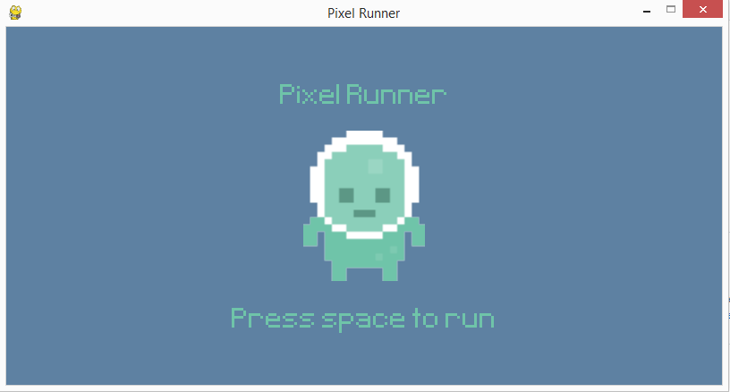
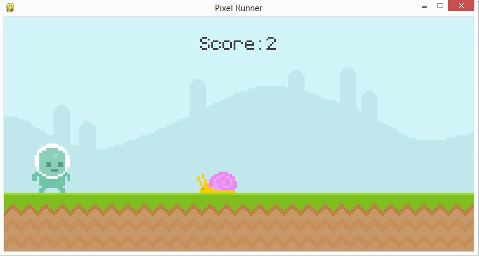

# pixel_runner 

# in_action

## [Check out This Link for the Original Author, Clear Code's Tutorial](https://www.youtube.com/watch?v=AY9MnQ4x3zk&ab_channel=ClearCode)

### [Clear Code's Official Repository](https://github.com/clear-code-projects/UltimatePygameIntro)

### [Link to the artwork](https://opengameart.org/content/platformer-art-pixel-edition)

### [Link to the background music](https://opengameart.org/content/5-chiptunes-action)

&nbsp;&nbsp;&nbsp;&nbsp;&nbsp;&nbsp;Who said that learning programming couldn't be fun? Watching Clear Code's tutorial is engaging and informative.
As I continue my own quest for knowledge, I branched off from the Introduction to Python 3 Programming from Gale Courses,
and found myself in an amazing tutorial that added to the fundamentals...

#### And immersed myself with game source code.

### You should be able to download the whole file as a .zip:
* Extract the zip to your desired file location 
* Execute pixel_runner.py
* Score the most points jumping and dodging the obstacles
* Level up your own skills by following [Clear Code's Tutorial](https://www.youtube.com/watch?v=AY9MnQ4x3zk&ab_channel=ClearCode)
